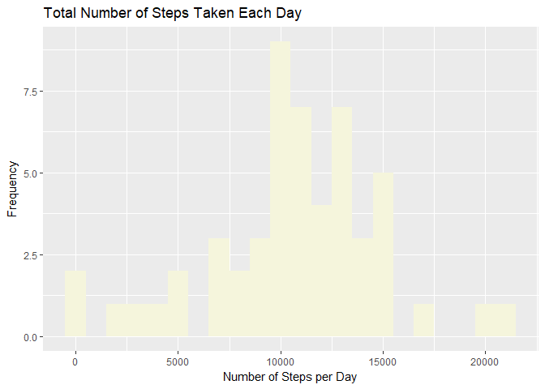
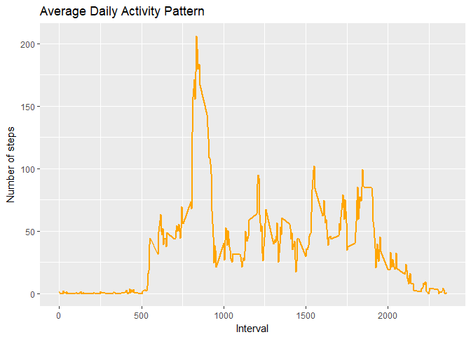
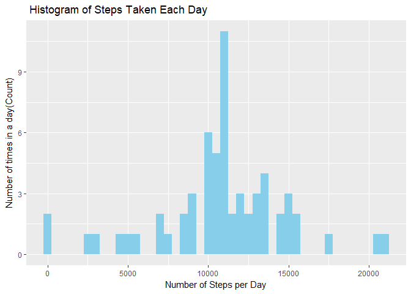
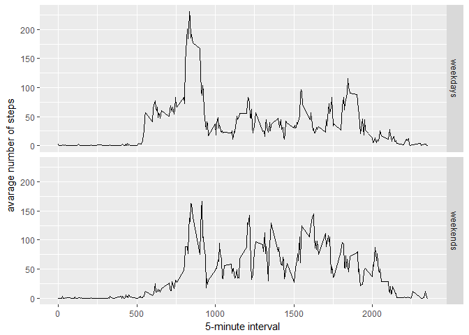

---
title:
output: 
  html_document: 
    keep_md: yes
---


Reproducible Research: Peer Assessment 1
========================================

This is my assignment.

Loading and preprocessing the data.

1. Load the data.


```r
# Set the date format
Sys.setlocale("LC_TIME", "English")
```

```
## [1] "English_United States.1252"
```

```r
# Load package
require(ggplot2)

# Load raw data
if(!file.exists("./data")){dir.create("./data")}
fileUrl<-"https://d396qusza40orc.cloudfront.net/repdata%2Fdata%2Factivity.zip"
download.file(fileUrl, destfile="activity.zip")
unzip ("activity.zip")

# Read the data
Data <- read.csv("activity.csv")
```

2.Process/transform the data (if necessary) into a format suitable for analysis.


```r
# Head data
head(Data)
```

```
##   steps       date interval
## 1    NA 2012-10-01        0
## 2    NA 2012-10-01        5
## 3    NA 2012-10-01       10
## 4    NA 2012-10-01       15
## 5    NA 2012-10-01       20
## 6    NA 2012-10-01       25
```


```r
# Dimension data
dim(Data)
```

```
## [1] 17568     3
```


```r
# Summary data
summary(Data)
```

```
##      steps                date          interval     
##  Min.   :  0.00   2012-10-01:  288   Min.   :   0.0  
##  1st Qu.:  0.00   2012-10-02:  288   1st Qu.: 588.8  
##  Median :  0.00   2012-10-03:  288   Median :1177.5  
##  Mean   : 37.38   2012-10-04:  288   Mean   :1177.5  
##  3rd Qu.: 12.00   2012-10-05:  288   3rd Qu.:1766.2  
##  Max.   :806.00   2012-10-06:  288   Max.   :2355.0  
##  NA's   :2304     (Other)   :15840
```


```r
# Create clean data for later calculations
Data$date <- as.Date(as.character(Data$date))
DataNA <- is.na(Data$steps)
```

What is mean total number of steps taken per day?

1.Calculate the total number of steps taken per day


```r
# Aggregate summary steps
Sumsteps <- aggregate(Data$steps, by=list(Data$date), sum)
names(Sumsteps)[1:2]<-c("date","totalsteps")
head(Sumsteps,15)
```

```
##          date totalsteps
## 1  2012-10-01         NA
## 2  2012-10-02        126
## 3  2012-10-03      11352
## 4  2012-10-04      12116
## 5  2012-10-05      13294
## 6  2012-10-06      15420
## 7  2012-10-07      11015
## 8  2012-10-08         NA
## 9  2012-10-09      12811
## 10 2012-10-10       9900
## 11 2012-10-11      10304
## 12 2012-10-12      17382
## 13 2012-10-13      12426
## 14 2012-10-14      15098
## 15 2012-10-15      10139
```

2.Make a histogram of the total number of steps taken each day.

```r
# Generate a plot
ggplot(Sumsteps, aes(x = totalsteps)) +
  geom_histogram(fill = "beige", binwidth=1000) +
  labs(title = "Total Number of Steps Taken Each Day", x = "Number of Steps per Day", y = "Frequency")
```

```
## Warning: Removed 8 rows containing non-finite values (stat_bin).
```

<!-- -->

3.Calculate and report the mean and median of the total number of steps taken per day.

```r
# Mean of steps taken per day
mean(Sumsteps$totalsteps,na.rm=TRUE)
```

```
## [1] 10766.19
```


```r
# Median of steps taken per day
median(Sumsteps$totalsteps,na.rm=TRUE)
```

```
## [1] 10765
```

What is the average daily activity pattern?

1.Make a time series plot of the 5-minute interval (x-axis) and the average number of steps taken, averaged across all days (y-axis).


```r
# Generate a plot
stepsperinterval <- Data[!DataNA,]
MeanInterval <- aggregate(stepsperinterval$steps, by=list(stepsperinterval$interval), mean)
colnames(MeanInterval) <-c("interval","steps")

ggplot(MeanInterval, aes(x = interval, y=steps)) +
  labs(title = "Average Daily Activity Pattern", x = "Interval", y = "Number of steps")+
  geom_line(color="orange", size= 1) 
```

<!-- -->


2.Which 5-minute interval, on average across all the days in the dataset, contains the maximum number of steps?


```r
# Extract maximum number of steps
maxInterval <- MeanInterval[which.max(MeanInterval$steps),]
maxInterval
```

```
##     interval    steps
## 104      835 206.1698
```

Imputing missing values

1.Calculate and report the total number of missing values in the dataset.


```r
# Create a list for NA's
missingVals <- sum(DataNA)
missingVals
```

```
## [1] 2304
```

2.Devise a strategy for filling in all of the missing values in the dataset.


```r
# Create new dataset
dataset <- Data
NAdataset <- dataset[is.na(dataset$steps),]
cleandataset <- dataset[!is.na(dataset$steps),]

# Create Mean Data by interval
MeanDataInterval <- aggregate(cleandataset$steps, by=list(cleandataset$interval), sum)
colnames(MeanDataInterval) <-c("interval","steps")
```
3.Create a new dataset that is equal to the original dataset but with the missing data filled in.


```r
# Create missing data
dataset <- Data
missingData <- is.na(dataset$steps)
meanVals <- tapply(cleandataset$steps, cleandataset$interval, mean, na.rm=TRUE, simplify=TRUE)
dataset$steps[missingData] <- meanVals[as.character(dataset$interval[missingData])]
sum(missingData)
```

```
## [1] 2304
```


```r
# Count of NA values
sum(is.na(dataset$steps))
```

```
## [1] 0
```

4.Make a histogram of the total number of steps taken each day and Calculate and report the mean and median total number of steps taken per day.  

```r
# Create data about total number of steps taken each day
FullSumDataDay <- aggregate(dataset$steps, by=list(dataset$date), sum)

names(FullSumDataDay)[1:2] <-c("date","totalsteps")
head(FullSumDataDay,15)
```

```
##          date totalsteps
## 1  2012-10-01   10766.19
## 2  2012-10-02     126.00
## 3  2012-10-03   11352.00
## 4  2012-10-04   12116.00
## 5  2012-10-05   13294.00
## 6  2012-10-06   15420.00
## 7  2012-10-07   11015.00
## 8  2012-10-08   10766.19
## 9  2012-10-09   12811.00
## 10 2012-10-10    9900.00
## 11 2012-10-11   10304.00
## 12 2012-10-12   17382.00
## 13 2012-10-13   12426.00
## 14 2012-10-14   15098.00
## 15 2012-10-15   10139.00
```


```r
# Generate a Plot
ggplot(FullSumDataDay, aes(x = totalsteps)) +
  geom_histogram(fill = "sky blue", binwidth=500) +
  labs(title = " Histogram of Steps Taken Each Day", x = "Number of Steps per Day", y = "Number of times in a day(Count)")
```

<!-- -->


```r
# Mean on Data
mean(FullSumDataDay$totalsteps)
```

```
## [1] 10766.19
```


```r
# Median on Data
median(FullSumDataDay$totalsteps)
```

```
## [1] 10766.19
```

Are there differences in activity patterns between weekdays and weekends?

1.Create a new factor variable in the dataset with two levels ¨C ¡°weekday¡± and ¡°weekend¡± indicating whether a given date is a weekday or weekend day.


```r
# Create a new factor variable
dataset$weekday<- ifelse(as.POSIXlt(dataset$date)$wday %in% c(0,6), "weekends","weekdays")
```


2.Make a panel plot containing a time series plot of the 5-minute interval (x-axis) and the average number of steps taken, averaged across all weekday days or weekend days (y-axis). See the README file in the GitHub repository to see an example of what this plot should look like using simulated data.


```r
# Generate a panel plot
aggregateData<- aggregate(steps ~ interval + weekday, data=dataset, mean)
ggplot(aggregateData, aes(interval, steps)) + 
    geom_line() + 
    facet_grid(weekday ~ .) +
    xlab("5-minute interval") + 
    ylab("avarage number of steps")
```

<!-- -->


There seems to be variation in the beginning of the day during weekdays, likely due to workplace activities. There seems to be an overall slightly larger incidence of steps during the weekends.


